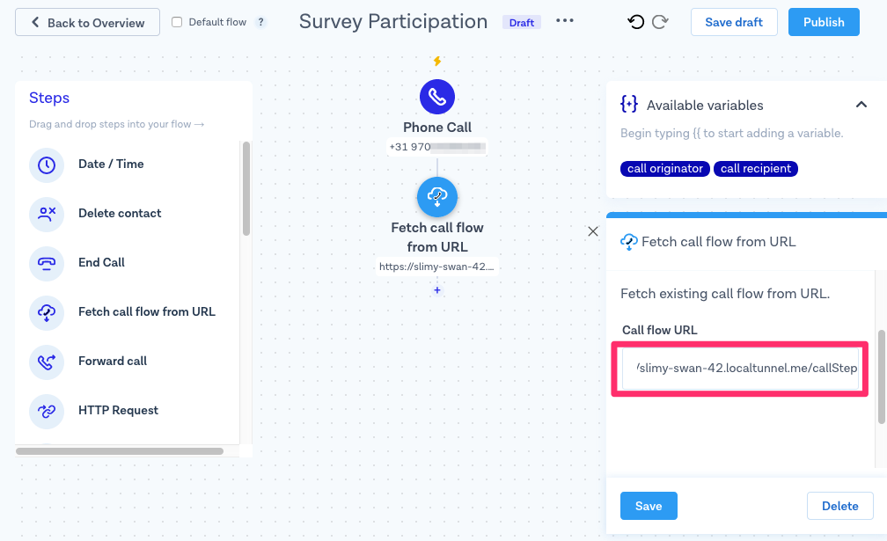

# Automated Voice Surveys
### ⏱ 15 min build time 

## Why build automated voice surveys?

Surveys are a great way to gather feedback about a product or a service. In this MessageBird Developer guide, we'll look at a company that wants to collect surveys over the phone by providing their customers a feedback number that they can call and submit their opinion as voice messages that the company's support team can listen to on a website and incorporate that feedback into the next version of the product. This team should be able to focus their attention on the input on their own time instead of having to wait and answer calls. Therefore, the feedback collection itself is fully automated. 

## Getting Started

The sample application is built in Node.js using the [Express](https://www.npmjs.com/package/express) framework. You can download or clone the complete source code from the [MessageBird Developer Guides GitHub repository](https://github.com/messagebirdguides/automated-surveys-guide) to run the application on your computer and follow along with the guide. To run the sample, you need to have Node and npm set up, which you can [install from nodejs.org](https://nodejs.org/en/download/).

Let's get started by opening the directory of the sample application and running the following command to install the dependencies:

````bash
npm install
````

The sample application uses [mongo-mock](https://www.npmjs.com/package/mongo-mock) to provide an in-memory database for testing, so you don't need to configure an external database. As the mock loses data when you restart the application you need to replace it with a real MongoDB server when you want to develop this sample into a production application.

## Designing the Call Flow

Call flows in MessageBird are sequences of steps. Each step can be a different action, such as playing an audio file, speaking words through text-to-speech (TTS), recording the caller's voice or transferring the call to another party. The call flow for this survey application alternates two types of actions: saying the question (`say` action) and recording an answer (`record` action). Other action types are not required. The whole flow begins with a short introduction text and ends on a "Thank you" note, both of which are implemented as `say` actions.

The survey application generates the call flow dynamically through Javascript code and provides it on a webhook endpoint as a JSON response that MessageBird can parse. It does not, however, return the complete flow at once. The generated steps always end on a `record` action with the `onFinish` attribute set to the same webhook endpoint URL. This approach simplifies the collection of recordings because whenever the caller provides an answer, an identifier for the recording is sent with the next webhook request. The endpoint will then store information about the answer to the question and return additional steps: either the next question together with its answer recording step or, if the caller has reached the end of the survey, the final "Thank you" note.

The sample implementation contains only a single survey. For each participant, we create a (mocked) MongoDB document that includes a unique MessageBird-generated identifier for the call, their number and an array of responses. As the webhook is requested multiple times for each caller,  once in the beginning and once for each answer they record, the length of the responses array indicates their position within the survey and determines the next step.

All questions are stored as an array in the file `questions.json` to keep them separate from the implementation. The following statement at the top of `index.js` loads them:

````javascript
var questions = require('./questions.json');
````

## Prerequisites for Receiving Calls

### Overview

Participants take part in a survey by calling a dedicated virtual phone number. MessageBird accepts the call and contacts the application on a _webhook URL_, which you assign to your number on the MessageBird Dashboard using a flow. A [webhook](https://en.wikipedia.org/wiki/Webhook) is a URL on your site that doesn't render a page to users but is like an API endpoint that can be triggered by other servers. Every time someone calls that number, MessageBird checks that URL for instructions on how to interact with the caller.

### Exposing your Development Server with localtunnel

When working with webhooks, an external service like MessageBird needs to access your application, so the URL must be public. During development, though, you're typically working in a local development environment that is not publicly available. There are various tools and services available that allow you to quickly expose your development environment to the Internet by providing a tunnel from a public URL to your local machine. One of these tools is [localtunnel.me](https://localtunnel.me), which is uniquely suited to Node.js developers since you can comfortably install it using npm:

````bash
npm install -g localtunnel
````

You can launch a tunnel by providing a local port number on which your application runs. Our application is configured to run on port 8080, so you can start localtunnel with the following command:

````bash
lt --port 8080
````

After you've started the tunnel, localtunnel displays your temporary public URL. We'll need that in a minute.

If you're facing problems with localtunnel.me, you can have a look at other common tools such as [ngrok](https://ngrok.com), which works in virtually the same way.

### Getting an Inbound Number

A requirement for programmatically taking voice calls is a dedicated inbound number. Virtual telephone numbers live in the cloud, i.e., a data center. MessageBird offers numbers from different countries for a low monthly fee. Here's how to purchase one:

1. Go to the [Numbers](https://dashboard.messagebird.com/en/numbers) section of your MessageBird account and click **Buy a number**.
2. Choose the country in which you and your customers are located and make sure the _Voice_ capability is selected.
3. Choose one number from the selection and the duration for which you want to pay now. 

4. Confirm by clicking **Buy Number**.

Excellent, you have set up your first virtual number!

### Connecting the Number to your Application

So you have a number now, but MessageBird has no idea what to do with it. That's why you need to define a _Flow_ next that ties your number to your webhook:

1. Open the Flow Builder and click **Create new flow**.
2. In the following dialog, choose **Create Custom Flow**.
3. Give your flow a name, such as "Survey Participation", select _Phone Call_ as the trigger and continue with **Next**. 

4. Configure the trigger step by ticking the box next to your number and click **Save**. 

5. Press the small **+** to add a new step to your flow and choose **Fetch call flow from URL**. 

6. Paste the localtunnel base URL into the form and append `/callStep` to it - this is the name of our webhook handler route. Click **Save**. 

7. Hit **Publish** and your flow becomes active!

## Implementing the Call Steps

The route `app.all('/callStep')` in `index.js` contains the implementation of the survey call flow. It is specified with `all()` because the first request to fetch the call flow uses GET and subsequent requests that include recording information use POST. It starts with the basic structure for a JSON call flow object called `flow`, which we'll extend depending on where we are within our survey:

````javascript
app.all('/callStep', function(req, res) {
    // Prepare a Call Flow that can be extended
    var flow = {
        title : "Survey Call Step",
        steps : []
    };
````

Next, we connect to MongoDB, select a collection and try to find an existing call:

````javascript
    MongoClient.connect(dbUrl, {}, function(err, db) {        
        var surveyParticipants = db.collection('surveyParticipants');
        
        // Find a database entry for the number
        surveyParticipants.findOne({ callId : req.query.callID },
            function(err, doc) {
````

The application continues inside the callback function. First, we determine the ID (i.e., array index) of the next question, which is 0 for new participants or the number of existing answers plus one for existing ones:

````javascript
                // Determine the next question
                var questionId =
                    (doc == null) ? 0 // The person is just starting the survey
                    : doc.responses.length + 1;
````

For new participants, we also need to create a document in the MongoDB collection and persist it to the database. This record contains the identifier of the call and the caller ID, which are taken from the query parameters sent by MessageBird as part of the webhook (i.e., call flow fetch) request, `callID` and `destination` respectively. It includes an empty responses array as well.

````javascript
                if (doc == null) {
                    // Create new participant database entry
                    var doc = {
                        callId : req.query.callID,
                        number : req.query.destination,
                        responses : []
                    };
                    surveyParticipants.insertOne(doc, function(err, result) {
                        console.log("created survey participant", err, result);
                    });
                }
````

Next, if we're not in the initial but a subsequent webhook request, we will have received a JSON payload with data about the recording. If you scroll up in `index.js`, you'll find the initialization code for the Express framework. Among other things, it configures the [body-parser](https://www.npmjs.com/package/body-parser) helper library to accept JSON inputs. As MessageBird sends the inputs without `Content-Type`, we need to adjust the following configuration:

````javascript
app.use(bodyParser.json({
    type : function(req) {
        // Parse all bodies as JSON even without Content-Type
        return true;
    }
}));
````

Let's move back to our route's implementation. The answers are persisted by adding them to the responses array and then updating the document in the MongoDB collection. For every answer we store two identifiers from the parsed JSON request body: the `legId` that identifies the caller in a multi-party voice call and is required to fetch the recording, as well as the `id` of the recording itself which we store as `recordingId`:

````javascript
                if (questionId > 0) {
                    // Unless we're at the first question, store the response
                    // of the previous question
                    doc.responses.push({
                        legId : req.body.legId,
                        recordingId : req.body.id
                    });
                    surveyParticipants.updateOne({ number : req.query.destination }, {
                        $set: {
                            responses : doc.responses
                        }
                    }, function(err, result) {
                        console.log("updated survey participant", err, result);
                    });
                }
````

Now it's time to ask a question. Let's first check if we reached the end of the survey. That is determined by whether the question index equals the length of the questions list and therefore is out of bounds of the array, which means there are no further questions. If so, we thank the caller for their participation:

````javascript
                if (questionId == questions.length) {
                    // All questions have been answered
                    flow.steps.push(say("You have completed our survey. Thank you for participating!"));
````

You'll notice the `say()` function. It is a small helper function we've declared separately in the initial section of `index.js` to simplify the creation of `say` steps as we need them multiple times in the application. The function returns the action in the format expected by MessageBird so it can be added to the `steps` of a flow using `push()`, as seen above.

A function like this allows setting options for `say` actions at a central location. You can modify it if you want to, for example, specify another language or voice.

````javascript
function say(payload) {
    return {
        action : 'say',
        options : {
            payload : payload,
            voice : 'male',
            language: 'en-US'
        }
    };
}
````

Back in the route, there's an else-block that handles all questions other than the last. There's another nested if-statement in it, though, to treat the first question, as we need to read a welcome message to our participant _before_ the question:

````javascript
                } else {
                    if (questionId == 0) {
                        // Before first question, say welcome
                        flow.steps.push(say("Welcome to our survey! You will be asked " + questions.length + " questions. The answers will be recorded. Speak your response for each and press any key on your phone to move on to the next question. Here is the first question:"));
                    }
````

Finally, here comes the general logic used for each question:
* Ask the question using `say`.
* Request a recording.

````javascript
                    // Ask next question
                    flow.steps.push(say(questions[questionId]));

                    // Request recording of question
                    flow.steps.push({
                        action : 'record',
                        options : {
                            // Finish either on key press or after 10 seconds of silence
                            finishOnKey : 'any',
                            timeout : 10,
                            // Send recording to this same call flow URL
                            onFinish : req.protocol + "://" + req.hostname + '/callStep',
                        }
                    })
````

The `record` step is configured so that it finishes when the caller presses any key on their phone's keypad (`finishOnKey` attribute) or when MessageBird detects 10 seconds of silence (`timeout` attribute). By specifying the URL with the `onFinish` attribute we can make sure that the recording data is sent back to our route and that we can send additional steps to the caller. Building the URL with protocol and hostname information from the request ensures that it works wherever the application is deployed and also behind the tunnel.

Only one tiny part remains: the last step in each webhook request is sending back a JSON response based on the `flow` object:

````javascript
                res.json(flow);
````

## Building an Admin View

The survey application also contains an admin view that allows us to view the survey participants and listen to their responses. The implementation of the `app.get('/admin')` route is straightforward, it essentially loads everything from the database plus the questions data and adds it to the data available for a [Handlebars](http://handlebarsjs.com/) template.

The template, which you can see in `views/participants.handlebars`, contains a basic HTML structure with a three-column table. Inside the table, two nested loops over the participants and their responses add a line for each answer with the number of the caller, the question and a "Listen" button that plays it back.

Let's have a more detailed look at the implementation of this "Listen" button. On the frontend, the button calls a Javascript function called `playAudio()` with the `callId`, `legId` and `recordingId` inserted through Handlebars expressions:

````html
<button onclick="playAudio('{{p.callId}}','{{this.legId}}','{{this.recordingId}}')">Listen</button>
````

The implementation of that function dynamically generates an invisible, auto-playing HTML5 audio element:

````javascript
function playAudio(callId, legId, recordingId) {
    document.getElementById('audioplayer').innerHTML
        = '<audio autoplay="1"><source src="/play/' + callId
            + '/' + legId + '/' + recordingId
            + '" type="audio/wav"></audio>';
}
````

As you can see, the WAV audio is requested from a route of the survey application. This route acts as a proxy server that fetches the audio from MessageBird's API and uses the `pipe()` function to forward it to the frontend. This architecture is necessary because we need a MessageBird API key to fetch the audio but don't want to expose it on the client-side of our application. We use [request](https://www.npmjs.com/package/request) to make the API call and add the API key as an HTTP header:

````javascript
app.get('/play/:callId/:legId/:recordingId', function(req, res) {
    // Make a proxy request to the audio file on the API
    request({
        url : 'https://voice.messagebird.com/calls/' + req.params.callId + '/legs/' + req.params.legId
            + '/recordings/' + req.params.recordingId + '.wav',
        headers : {
            'Authorization' : 'AccessKey ' + process.env.MESSAGEBIRD_API_KEY
        }
    }).pipe(res);
});
````

As you can see, the API key is taken from an environment variable. To provide the key in the environment variable, [dotenv](https://www.npmjs.com/package/dotenv) is used. We've prepared an `env.example` file in the repository, which you should rename to `.env` and add the required information. Here's an example:

````env
MESSAGEBIRD_API_KEY=YOUR-API-KEY
````

You can create or retrieve a live API key from the [API access (REST) tab](https://dashboard.messagebird.com/en/developers/access) in the _Developers_ section of your MessageBird account.

## Testing your Application

Check again that you have set up your number correctly with a flow to forward incoming phone calls to a localtunnel URL and that the tunnel is still running. Remember, whenever you start a fresh tunnel, you'll get a new URL, so you have to update the flows accordingly. You can also configure a more permanent URL using the `-s` attribute with the `lt` command.

To start the application, let's open another console window as your existing console window is already busy running your tunnel. On a Mac you can press _Command_ + _Tab_ to open a second tab that's already pointed to the correct directory. With other operating systems you may have to resort to open another console window manually. Either way, once you've got a command prompt, type the following to start the application:

````bash
npm start
````

Now, take your phone and dial your survey number. You should hear the welcome message and the first question. Speak an answer and press any key. At that moment you should see some database debug output in the console. Open http://localhost:8080/admin to see your call as well. Continue interacting with the survey. In the end, you can refresh your browser and listen to all the answers you recorded within your phone call.

Congratulations, you just deployed a survey system with MessageBird!

## Supporting Outbound Calls

The application was designed for incoming calls where survey participants call a virtual number and can provide their answers. The same code works without any changes for an outbound call scenario as well. The only thing you have to do is to start a call through the API or other means and use a call flow that contains a `fetchCallFlow` step pointing to your webhook route.

## Nice work!

You now have a running integration of MessageBird's Voice API!

You can now leverage the flow, code snippets and UI examples from this tutorial to build your own automated voice survey. Don't forget to download the code from the [MessageBird Developer Guides GitHub repository](https://github.com/messagebirdguides/automated-surveys-guide).

## Next steps

Want to build something similar but not quite sure how to get started? Please feel free to let us know at support@messagebird.com, we'd love to help!